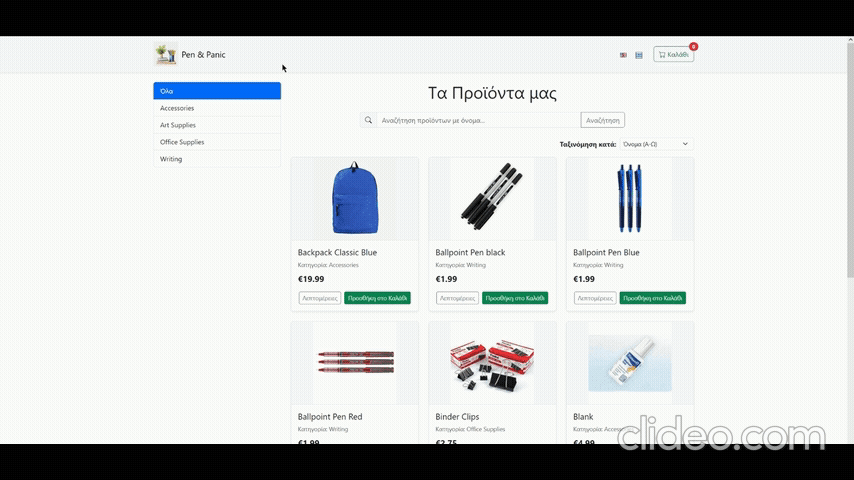
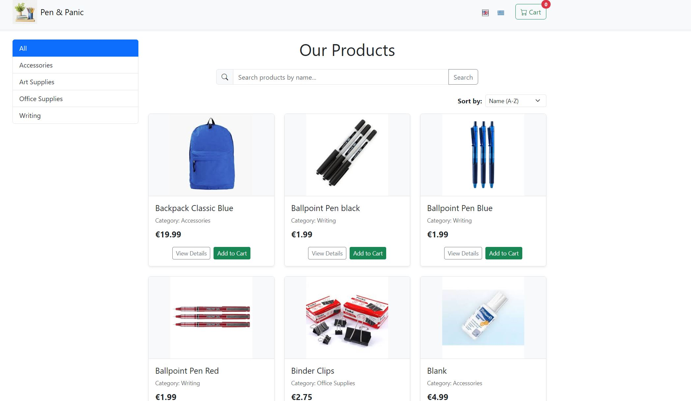
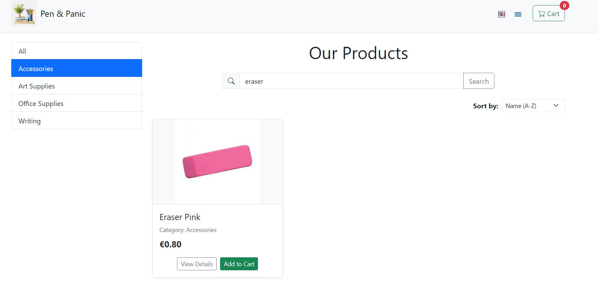
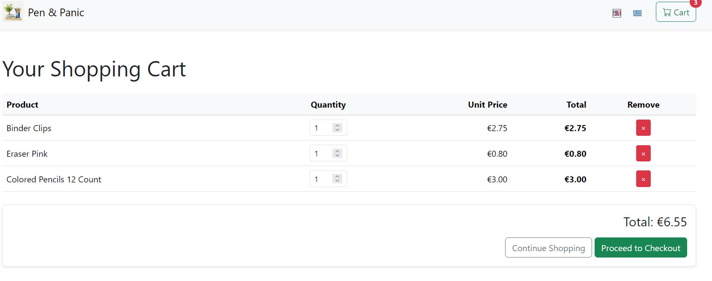
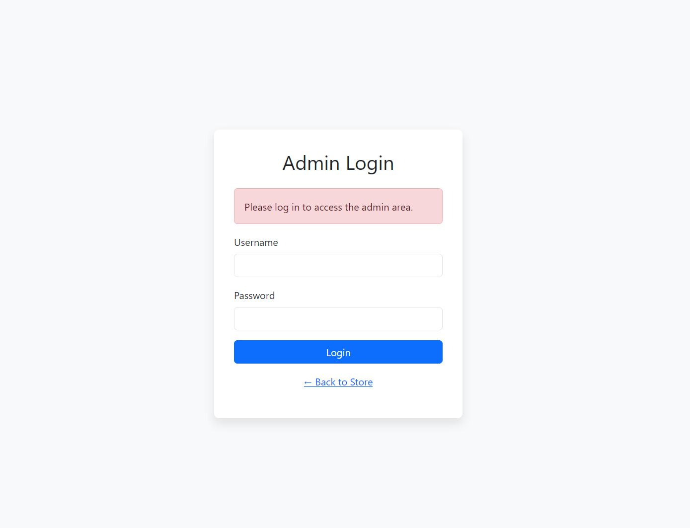
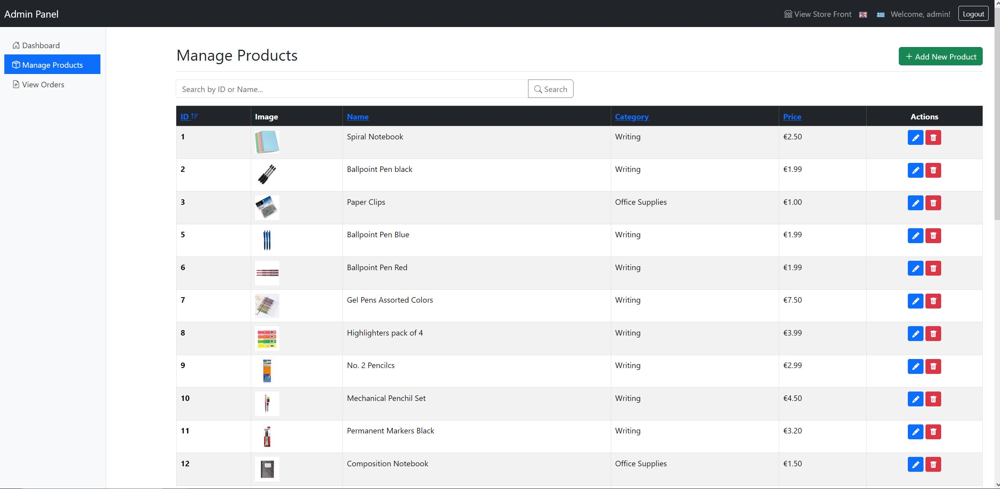
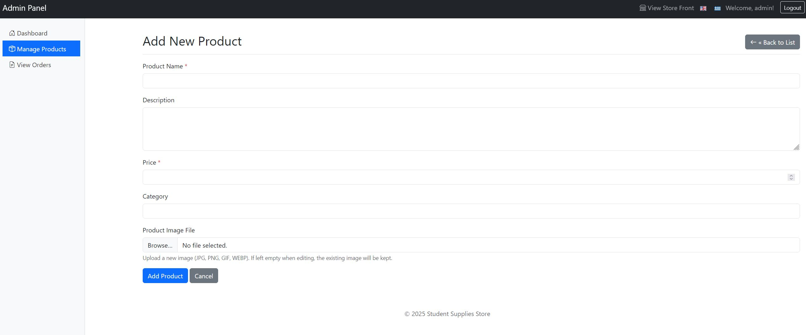
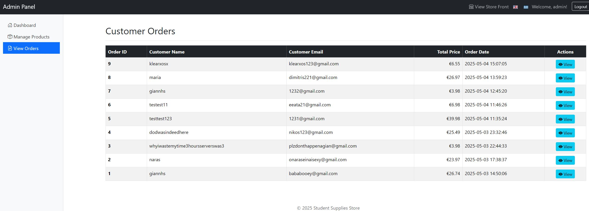
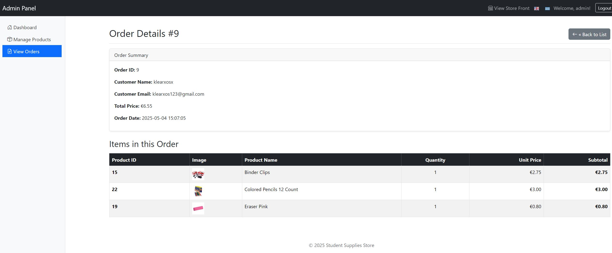

## Description

## Description

This is a simple full-stack e-shop web application developed as a student project. It allows users to browse and search for products, view them in a paginated list, sort them by price or name, and add items to a shopping cart. Orders can be placed without a login system to keep things simple and focused on functionality.

The project includes an admin panel for basic product management (add, edit, delete), viewing customer orders, and analyzing purchase trends with a chart showing the most purchased products.

This e-shop was built from scratch without using any frameworks, showcasing a solid understanding of full-stack development and database integration.

**Note**: If you want to access the admin panel, there is a text file inside the `student-supplies-store` folder that contains the admin password. I added a login and password for the admin panel for demonstration purposes, and you can find the details in that text file.

---

## This App Includes

- Frontend: HTML, CSS (Bootstrap), JavaScript  
- Backend: PHP (vanilla)  
- Database: MySQL  

---

## Features

- Product listing with images and pricing
- Search products by name
- Pagination for product listings
- Sorting by price or name
- Shopping cart functionality
- Place orders (no login required)
- Admin panel:
  - Product management (Add, Edit, Delete)
  - View placed orders
  - Sort products by ID, name, price, and category
  - View the most purchased products with a chart

---

### GIF Preview

---

## Screenshots

### Homepage

### Shopping Cart

### Admin Panel

  
  
  
  
  

---

## If You're Using Git

Clone the project into your machine with this command:

git clone https://github.com/RaeXp917/eshop-project

Then move the folder "student-supplies-store" into the XAMPP htdocs directory:

C:\xampp\htdocs\

---

## Setup Instructions (Manual Setup)

1. **Install XAMPP**  
   Download XAMPP from the official website: (If you haven't already!) 
   → [XAMPP Download](https://www.apachefriends.org/index.html)  
   Install the package, then open the XAMPP Control Panel.

2. **Start Apache and MySQL**  
   Open the XAMPP Control Panel and click **Start** for both **Apache** and **MySQL**. Ensure both services are running before proceeding.

3. **Place the Project Files in the Web Directory**  
   Copy the entire "student-supplies-store" folder and paste it into your XAMPP installation directory at:  
   `C:\xampp\htdocs\`  
   After this step, the full file path should be:  
   `C:\xampp\htdocs\student-supplies-store`

4. **Import the MySQL Database**  
   - Open your web browser and navigate to [http://localhost/phpmyadmin](http://localhost/phpmyadmin).  
   - In phpMyAdmin, click the **Import** tab located at the top.  
   - Click **Choose File**, then select the `database.sql` file from your project folder.  
   - Click **Go** to begin importing the database.

5. **Access the E-shop in Your Browser**  
   - Once the database is imported, open your browser and go to:  
   `http://localhost/student-supplies-store`  
   - You should now be able to see the homepage of the e-shop!

---
