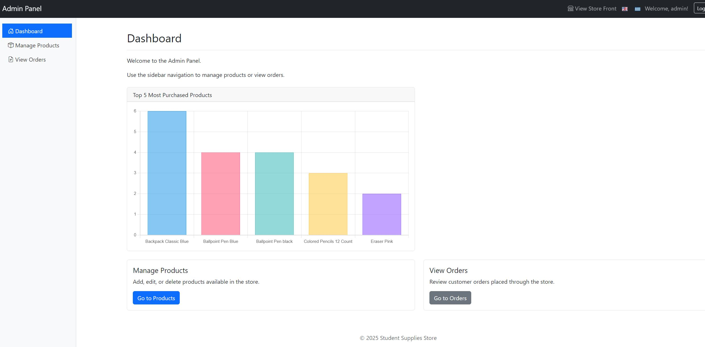

# Student Supplies Store (Pen & Panic)

Welcome! This is a full-stack e-shop web application developed as a student project, demonstrating core web development concepts. It allows users to browse and search for products, view them in a paginated list, sort them by price or name, and add items to a shopping cart. To keep things simple and focused on functionality, orders can be placed without requiring user registration.

**Languages**: The app includes support for two languages – Greek and English.

The project features a comprehensive admin panel enabling administrators to manage the store effectively. This includes viewing customer orders and analyzing purchase trends via a chart displaying the most purchased products. Crucially, the admin panel allows for seamless product management (adding, editing, and deleting items) directly through the user interface, eliminating the need for manual database manipulation or code changes.

This e-shop was built from scratch without using any frameworks, showcasing a solid understanding of full-stack development principles and database integration. I'm excited to share this project, which was a great learning experience!

---

## Table of Contents

*   [Features](#features)
*   [Technology Stack](#technology-stack)
*   [GIF Preview](#gif-preview)
*   [Screenshots](#screenshots)
*   [Getting Started (Docker Setup)](#getting-started-docker-setup)
    *   [Installation & Running](#installation--running)
    *   [Accessing the Application](#accessing-the-application)
    *   [Accessing the Admin Panel](#accessing-the-admin-panel)
    *   [Stopping the Application](#stopping-the-application)
---

## Features

*   Product listing with images and pricing
*   Search products by name
*   Pagination for product listings
*   Sorting by price or name (on the customer-facing side)
*   Shopping cart functionality
*   Place orders (no login required)
*   Multi-language support (English/Greek)
*   **Admin Panel:**
    *   Secure login (password in `admin_pass.txt`)
    *   Product management (Add, Edit, Delete products via UI)
    *   View placed customer orders
    *   **Sortable product list** (sort by ID, name, price, or category for easy management)
    *   **Sales analysis graph** showing the most frequently purchased products

---

## Technology Stack

*   **Frontend:** HTML, CSS (Bootstrap), JavaScript (including Chart.js for the admin graph)
*   **Backend:** PHP 8.2 (Vanilla)
*   **Database:** MySQL
*   **Containerization:** Docker & Docker Compose (using Apache Web Server via PHP image)

---

## GIF Preview


---

## Screenshots

### Homepage


### Shopping Cart


### Admin Panel




---

## Getting Started (Docker Setup)

This project uses Docker to ensure a consistent and easy setup process.

**Prerequisites:**
*   [Docker Desktop](https://www.docker.com/products/docker-desktop/) installed and running.
*   [Git](https://git-scm.com/downloads) installed (for cloning the repository).

### Installation & Running

1.  **Clone the Repository:**
    Open your terminal or command prompt and run:
    ```bash
    git clone https://github.com/RaeXp917/eshop-project.git
    ```
    
3.  **Navigate to Project Directory:**
    ```bash
    cd eshop-project/student-supplies-store
    ```
    *(Adjust if your repository root folder has a different name, e.g., `cd student-supplies-store`)*

4.  **Verify `database.sql`:**
    Confirm that the `database.sql` file exists in the project root directory. This file contains the necessary database schema and initial data required for the application to function.

5.  **Launch with Docker Compose:**
    Run the following command in the project directory:
    ```bash
    docker-compose up --build -d
    ```
    
### Accessing the Application

*   Once the containers are successfully running (the `docker-compose up` command completes), open your web browser and navigate to:
    http://localhost:8080
*   You should now see the e-shop homepage!

### Accessing the Admin Panel

*   To access the admin panel, visit http://localhost:8080/admin
*   You can find the necessary password inside the `admin_pass.txt` file located in the project's root directory.

### Stopping the Application

To stop the running Docker containers when you're finished:
1.  Navigate back to the project directory in your terminal.
2.  Run the command:
    ```bash
    docker-compose down
    ```
---
Thanks for checking out my project! I'm super excited about this one 'cause it shows how much I've improved! If you’ve got any tips or feedback, feel free to drop a comment!
